# Jellyfin2HQPlayer

**Version 1.3.0**

Jellyfin2HQPlayer is a web control interface for seamless integration between Jellyfin and HQPlayer.

Jellyfin acts as the media library backend, providing complete music management functions, including metadata, artist and album organization, and plugin extensions.  
Jellyfin2HQPlayer serves as the control layer, passing local file paths or HTTP URLs to HQPlayer via API.  
HQPlayer then directly reads the audio data, performs playback, and audio processing, providing a high-quality audio experience.

---

## 1. Playback Architecture

### 1.1 File Mode (Recommended)

When Jellyfin Server and HQPlayer are deployed on the same machine:

- Direct local file access
- No streaming
- No transcoding
- Shortest signal path
- Native bit-perfect playback

HQPlayer directly opens and reads the audio files.

---

### 1.2 HTTP File Mode (HQPlayer Recommended)

The original audio file is transmitted via the Jellyfin HTTP API (no transcoding when properly configured).

Features:

- File-like sequential access (sequential stream model)
- Continuous sequential reading
- No Range requests
- HQPlayer actively pulls audio data
- Behaves like local file access
- Retains playback control

Used for:

- Jellyfin and HQPlayer deployed on different machines

---

### 1.3 HTTP Stream Mode (Compatibility Mode)

The original audio file is transmitted via the Jellyfin HTTP API (no transcoding).

Features:

- HTTP streaming with Range access (random-access stream model)
- Supports Range requests
- Standard HTTP streaming behavior

Used for:

- Jellyfin and HQPlayer deployed on different machines

---

### 1.4 Playback Architecture Topology

[English](TOPOLOGY.md) | [中文](TOPOLOGY-cn.md)

---

## 2. Features

- Jellyfin music library integration
- HQPlayer playback control
- File Mode support
- HTTP File Mode support
- HTTP Stream Mode support
- Bit-perfect playback architecture
- Artist / Album / Metadata browsing
- Cover image support
- Lyrics plugin compatibility
- Web control interface
- Browser-based local preview listening
- HQPlayer playback history

---
## 2.1 Screenshots

### Desktop UI

Playing View

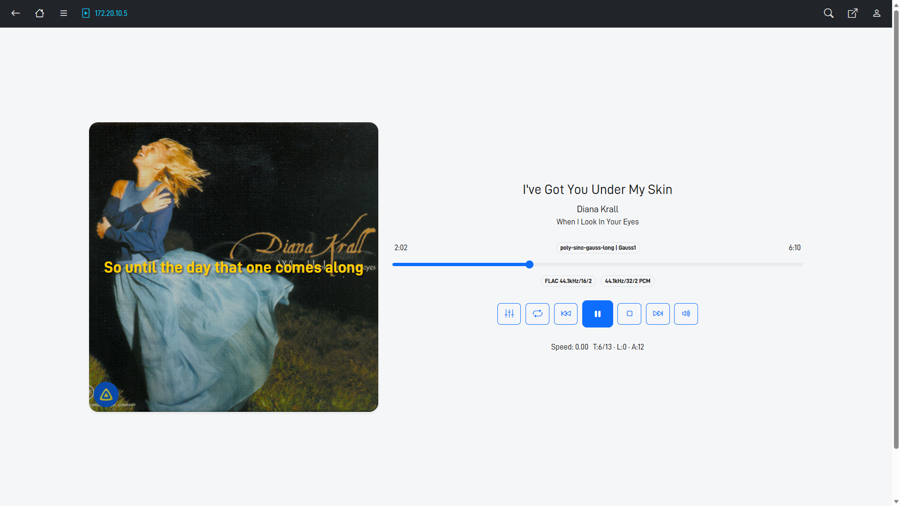

HQPlayer Queue

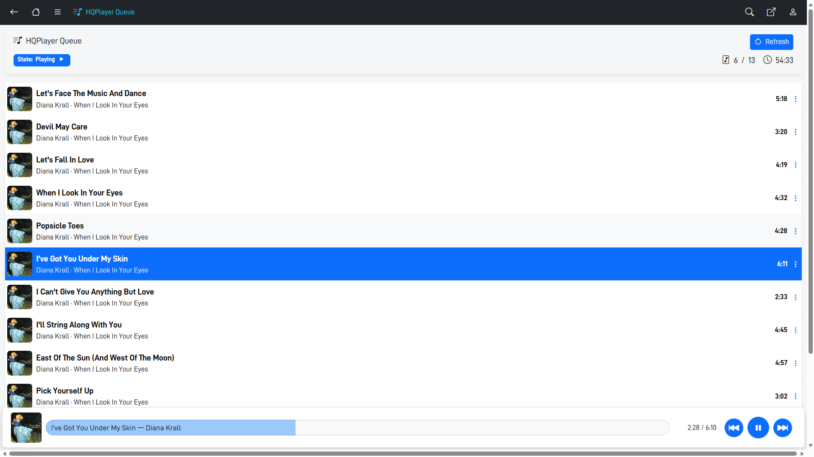

Spectrum Analyzer

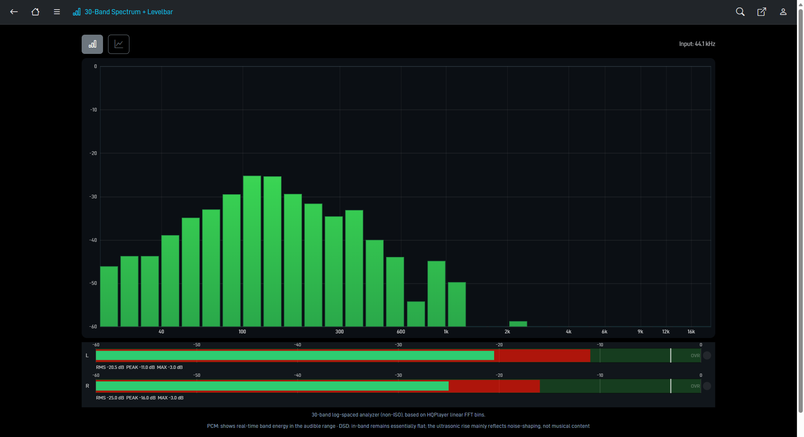

Spectrogram

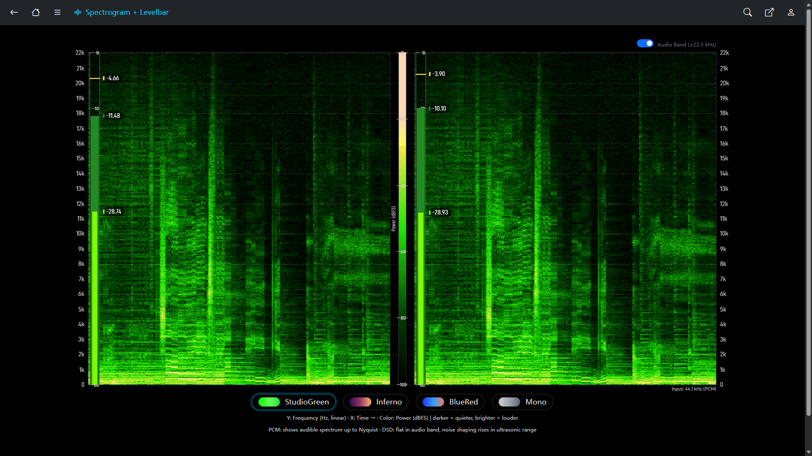

VU Meter

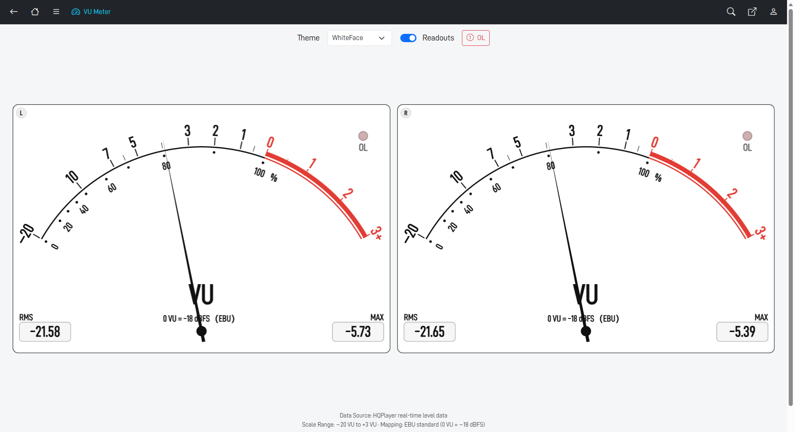

---

### Mobile UI

<table>
  <tr>
    <td>
      
Playing View

      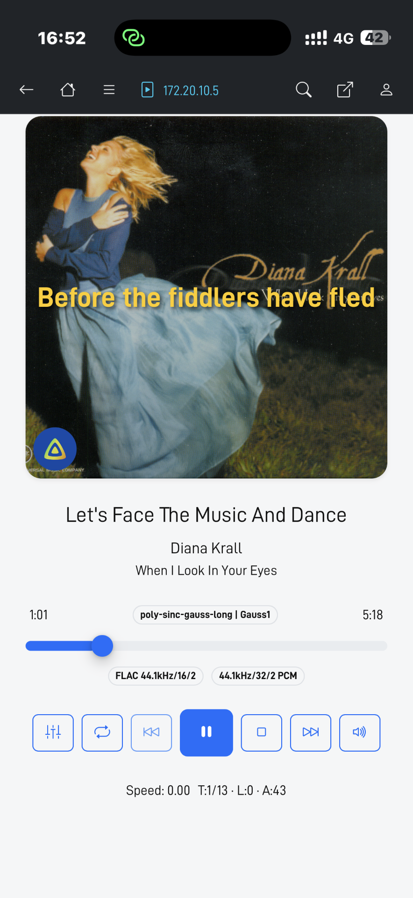
    </td>
    <td>
      
Settings

      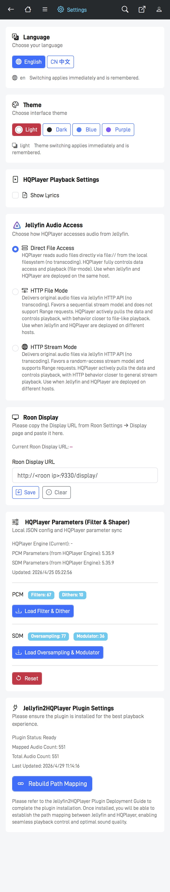
    </td>
  </tr>
  <tr>
    <td>
      
Spectrum Analyzer

      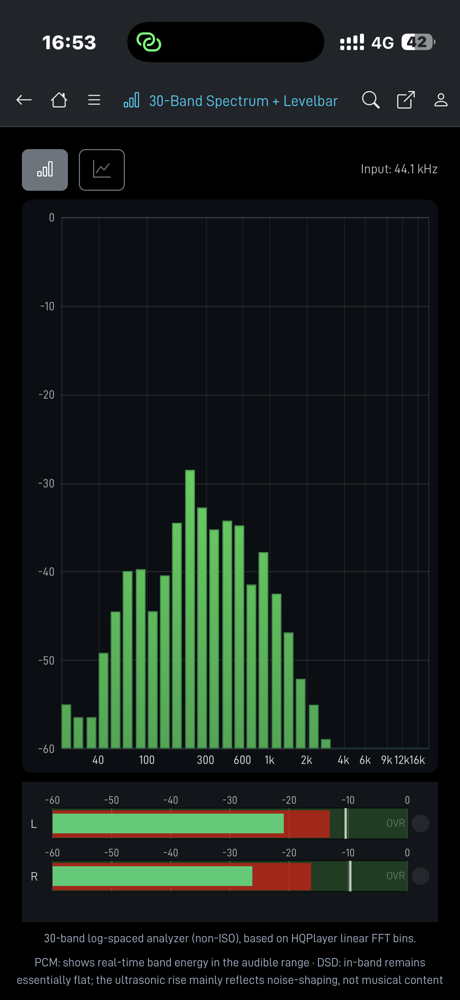
    </td>
    <td>
      
Spectrogram

      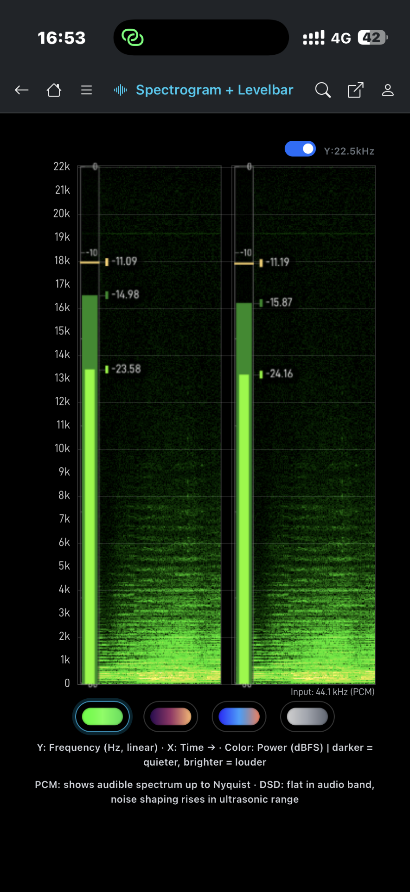
    </td>
  </tr>
  <tr>
    <td>
      
VU Meter

      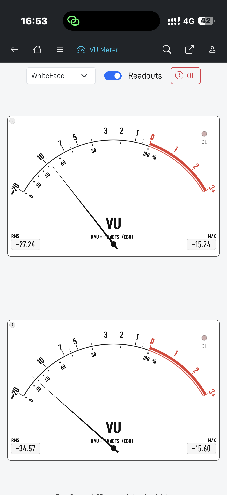
    </td>
    <td>
      
Home

      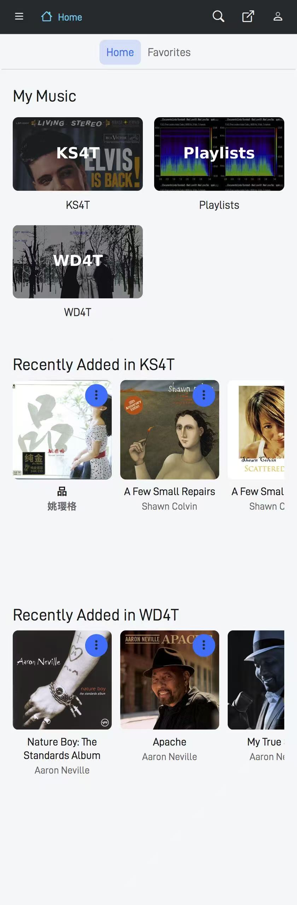
    </td>
  </tr>
  <tr>
    <td>
      
ArtistDetails

      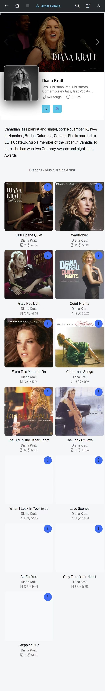
    </td>
    <td>
      
AlbumDetails

      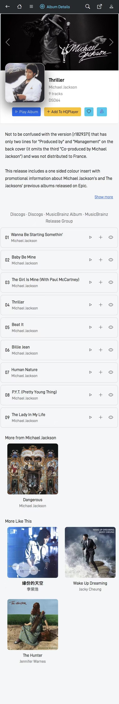
    </td>
  </tr>
  <tr>
    <td>
      
Suggestions

      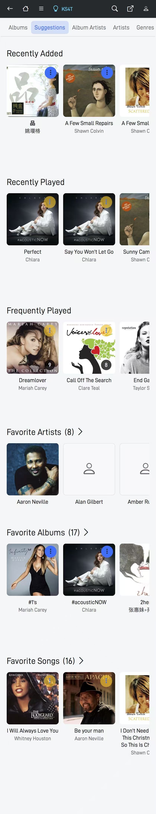
    </td>
    <td>
      
Search

      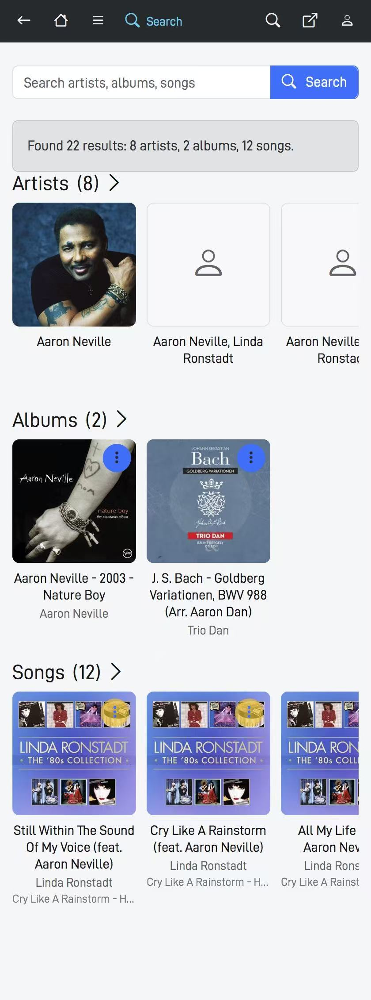
    </td>
  </tr>
</table>

---

## 3. Jellyfin Plugin

Jellyfin2HQPlayer Plugin provides:

- Audio file path → Jellyfin ItemId mapping
- REST API routes for Jellyfin2HQPlayer integration

GitHub:

[https://github.com/YTSamLee/Jellyfin2HQPlayer-plugin](https://github.com/YTSamLee/Jellyfin2HQPlayer-plugin)

---

## 4. Design Philosophy

Jellyfin provides complete music management, HQPlayer handles audio playback, and Jellyfin2HQPlayer integrates the two seamlessly.

This architecture achieves:

- Decoupling of the playback chain
- Shortest signal path
- Native bit-perfect playback

---

## 5. Quick Start

### 5.1 Install Jellyfin Server

Links:

- [English](install-jellyfin-en.txt) | [中文](install-jellyfin-cn.txt)

### 5.2 Deploy Jellyfin2HQPlayer

Links:

- [English](jellyfin2hqplayer-quickstart-en.txt) | [中文](jellyfin2hqplayer-quickstart-cn.txt)

### 5.3 Deploy Jellyfin2HQPlayerPlugin

Links:

- [English](Jellyfin2HQPlayerPlugin-en.txt) | [中文](Jellyfin2HQPlayerPlugin-cn.txt)

---

## 6. Contact Information

YTSam

Email: 563422071@qq.com

---

## License

Jellyfin2HQPlayer is proprietary closed-source software, distributed in binary form only.

Personal and non-commercial use is permitted. 
Commercial use requires explicit written permission.

See the [LICENSE](./LICENSE) file for full terms.

---

## Feedback and Discussion

Feel free to provide feedback and discuss the project in my personal thread on [audiophilestyle.com](https://audiophilestyle.com/forums/topic/71901-jellyfin2hqplayer-%E2%80%93-control-hqplayer-from-jellyfin-file-based-bit-perfect-playback/#comment-1337850).

Looking forward to your valuable suggestions and comments!

---

### 中文版本

[README 中文版](README-cn.md)

